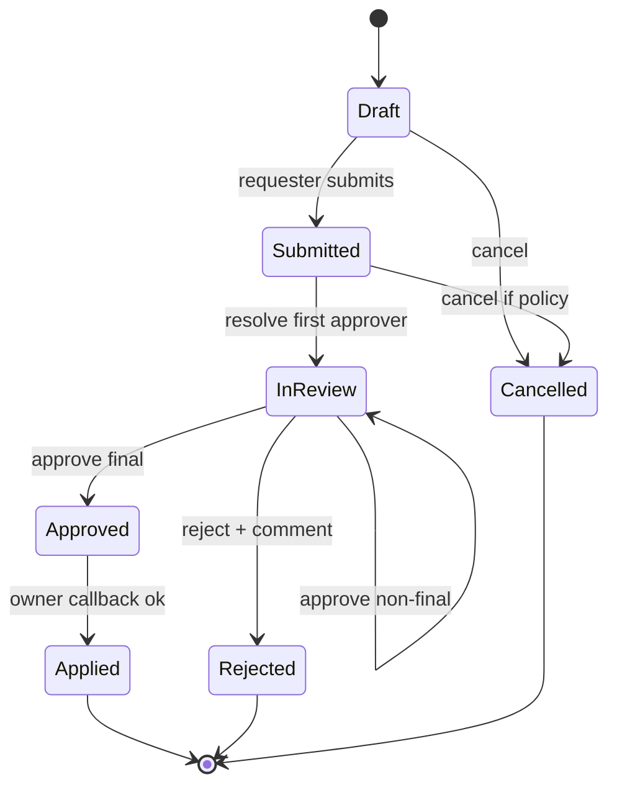
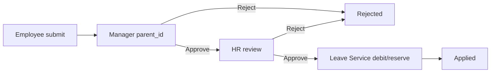
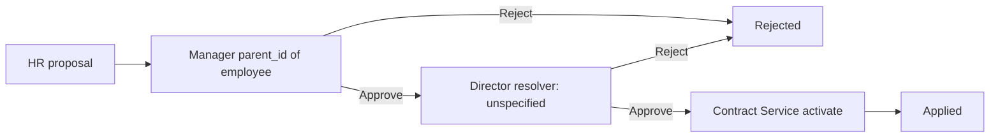
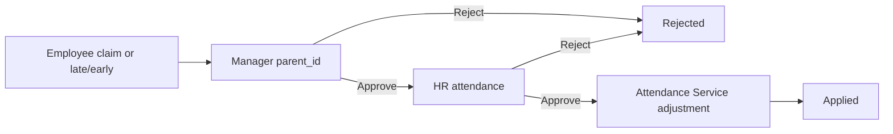

# 07 — Workflow Design

Engine: domain 09. Approver for “Manager” is always Employee `parent_id` (current `manager_employee_id`), snapshotted at submit. Org-chart walk is forbidden.

## Generic state machine

| State | Actor | Transitions | Permission |
|---|---|---|---|
| `draft` | Requester / HR proxy | submit, cancel | create-request permission |
| `submitted` | System | resolve current step | internal |
| `in_review` | Current approver or delegate only | approve, reject, reassign if policy | `hrm.workflow.approve` / `reject` / `reassign` |
| `approved` | Owner service | apply | internal callback |
| `applied` | — | terminal | — |
| `rejected` | — | terminal; remaining steps not run | — |
| `cancelled` | Requester / HR policy | terminal | cancel permission |

Optimistic `version` on every action. Stale action → `409 VERSION_CONFLICT`. Reject requires a non-empty comment.

---

## 1. Leave Request

Definition code: `leave_request` v1  
Path: Employee → Manager (`parent_id`) → HR → Completed

| Step | Resolver | Permission | Validation | Effect |
|---|---|---|---|---|
| Submit | requester | `hrm.leave.request.create` | type, dates, overlap, entitlement | `leave_requests.status=submitted`; start workflow |
| Manager | snapshotted `parent_id` | `hrm.workflow.approve` | actor is current step | advance |
| HR | HR assignee for employee company/dept | `hrm.workflow.approve` | policy + remaining balance | `leave.approved` + ledger |
| Apply | Leave Service | internal | idempotent | Attendance/lifecycle consume event |

Cancel: requester/HR while not terminal, if policy allows. Reject: no ledger debit.

---

## 2. Contract Renewal

Definition code: `contract_renewal` v1  
Path: HR → Manager → Director → Completed. Director is a configured resolver — **not** `parent_id`. Do not invent the mapping; the step exists, the actor source stays a gap until specified.

| Step | Actor | Permission | Condition |
|---|---|---|---|
| HR proposal | HR Staff / HR Manager | `hrm.contract.renew` | Contract active/eligible; proposed dates valid |
| Manager | Employee’s `parent_id` | `hrm.workflow.approve` | Snapshot at submit |
| Director | configured director resolver — **not** `parent_id`; do not invent the mapping | `hrm.workflow.approve` | Salary/term changes follow FLS/value policy |
| Apply | Contract Service | internal | New terms/appendix; history not overwritten; `contract.activated` |

---

## 3. Attendance Claim / Late-Early

Definition codes: `attendance_claim` v1, `late_early_request` v1  
Path: Employee → Manager → HR → Completed

Source `attendance_records` are never updated.

| Step | Permission | Domain rule |
|---|---|---|
| Submit | `hrm.attendance.claim.create` or `hrm.attendance.late_early.create` | date, type/minutes, reason; optional evidence document |
| Manager | `hrm.workflow.approve` | Team scope only |
| HR | `hrm.workflow.approve` | Compare evidence vs source record |
| Apply | internal | Insert `attendance_adjustments`; keep original record |

`overtime_request` “same path when configured” has no configuration owner in source. Do not ship that definition until one is specified.

`POST /contracts/{id}/terminate` has no workflow definition here. Persist the termination proposal; do not invent a terminate-contract step path.

---

## Inbox and SLA

`GET /api/v1/workflow/inbox` returns instances where the actor is current approver or active delegate, plus requester’s own items, plus HR admin scope.

Each `workflow_definition_steps` row has `sla_hours`. Inbox DTO includes `slaDueAt` and `slaState` (`on_track` / `due_soon` / `overdue`). SLA is operational, not a silent auto-approve.

## Delegation

`workflow_delegations`: time-bound, no self-delegate, no overlapping open delegation for the same domain type unless policy allows. Delegate acts with `hrm.workflow.approve`; action records both actor and delegator.

## Callback contract

Workflow emits `workflow.completed` or `workflow.rejected` only. Owner:

1. Load business entity by `businessEntityId`
2. Assert expected status/version
3. Apply or record rejection
4. Write own outbox
5. Ack with the same `requestId`

Retry is idempotent on `(domainType, businessEntityId, workflowInstanceId, eventType)`.
