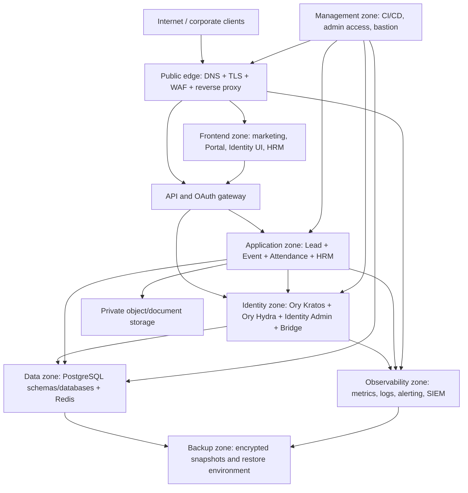

# Production Deployment Topology

This is the target topology for the existing QTS Spring/Ory deployment. It is
an architecture baseline, not evidence that a particular cloud or host already
provides every control.

## Exposure rules

- Only the public edge is Internet-facing.
- Frontend containers serve static assets; they do not receive database or Ory
  admin credentials.
- Ory public endpoints are exposed only through the approved Identity route.
- Ory admin APIs, service-to-service APIs, databases, Redis, object storage,
  observability and backup stores remain private.
- Spring services validate tokens locally using cached public keys where
  possible; they do not call the login UI for every business request.
- Database and backup traffic uses private network paths and explicit
  identities.
- Management access uses a bastion/VPN or an approved private control plane.

## Deployment requirements

1. Build immutable images from the repository and record image digests.
2. Run service containers as non-root with read-only filesystems where
   supported.
3. Keep production secrets in a secret manager or protected environment, never
   in an image, build argument, browser bundle or log.
4. Use exact HTTPS issuers and redirect URIs per environment.
5. Apply migrations in an ordered, backward-compatible release window.
6. Expose health endpoints only as approved management probes.
7. Record the compose/ingress revision, migration version and configuration
   checksum for every release.

## Capacity evidence

The operator must attach:

- CPU, memory, storage and network sizing;
- expected registered users and concurrent users;
- request and event rate model;
- database growth and backup size;
- scaling triggers and limits;
- maintenance and failover model.

The detailed-design reference includes sizing and physical deployment sections;
QTS must replace its project-specific hardware values with measured QTS
capacity evidence.

